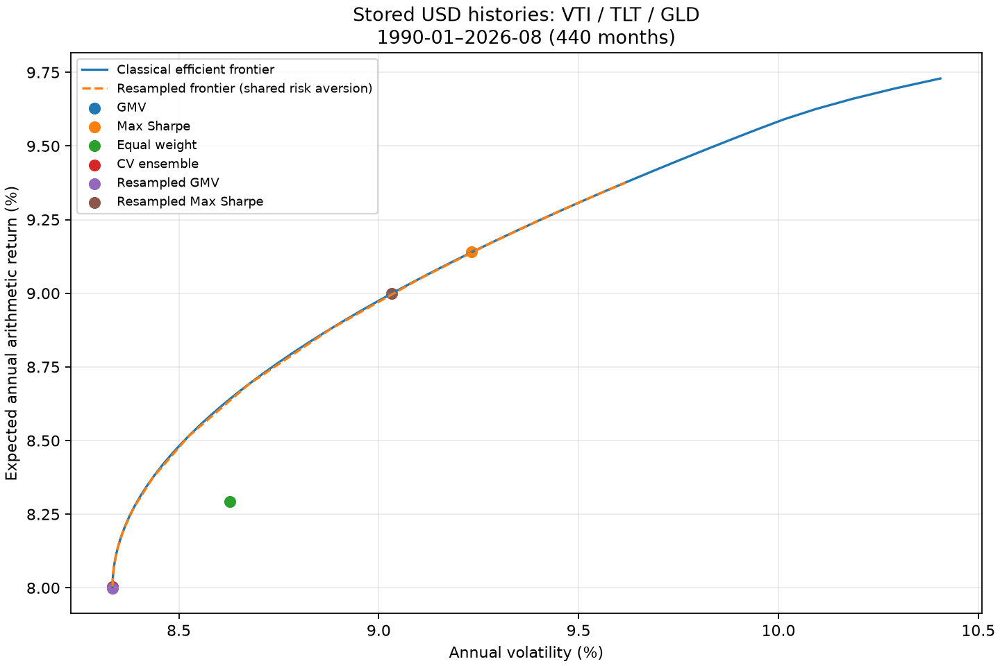
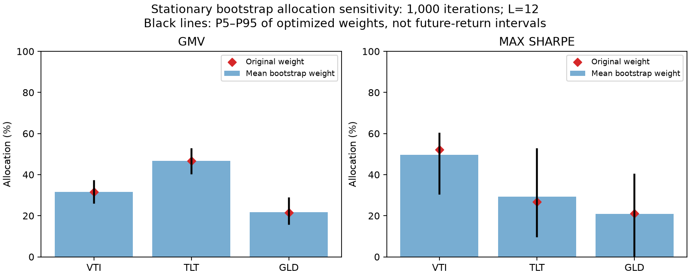

# Stored USD demonstration

Generated by `scripts/analytics_demo.py`. All observations come from the existing database. No synthetic or redownloaded histories.

Period: **1990-01 to 2026-08**, **440 months**. Annual risk-free rate: 3%.





## Portfolio comparison

| Portfolio | VTI | TLT | GLD | Expected return | Volatility | Sharpe | CAGR | Max drawdown |
|---|---:|---:|---:|---:|---:|---:|---:|---:|
| GMV | 31.68% | 46.69% | 21.63% | 8.00% | 8.33% | 0.600 | 7.93% | 24.43% |
| Max Sharpe | 52.17% | 26.79% | 21.05% | 9.14% | 9.23% | 0.665 | 9.07% | 23.15% |
| Equal weight | 33.33% | 33.33% | 33.33% | 8.29% | 8.63% | 0.613 | 8.22% | 21.53% |
| CV ensemble (full-sample) | 31.67% | 46.66% | 21.67% | 8.00% | 8.33% | 0.600 | 7.93% | 24.42% |
| Resampled gmv | 31.57% | 46.63% | 21.80% | 8.00% | 8.33% | 0.600 | 7.93% | 24.41% |
| Resampled max_sharpe | 49.69% | 29.38% | 20.92% | 9.00% | 9.03% | 0.664 | 8.94% | 23.13% |

CV ensemble and resampled statistics above use original full-sample estimates. They are not independent out-of-sample performance. The resampled portfolios are not assumed superior.

## Five-fold validation

| Fold | Training months | Validation interval | Months | VTI | TLT | GLD | Realized arithmetic return | Volatility | Sharpe |
|---|---:|---|---:|---:|---:|---:|---:|---:|---:|
| 1 | 352 | 1990-01–1997-04 | 88 | 33.67% | 48.26% | 18.07% | 8.54% | 6.60% | 0.838 |
| 2 | 352 | 1997-05–2004-08 | 88 | 34.97% | 43.13% | 21.90% | 7.31% | 7.59% | 0.567 |
| 3 | 352 | 2004-09–2011-12 | 88 | 29.33% | 45.79% | 24.88% | 11.18% | 8.94% | 0.915 |
| 4 | 352 | 2012-01–2019-04 | 88 | 28.66% | 47.57% | 23.78% | 5.28% | 7.17% | 0.318 |
| 5 | 352 | 2019-05–2026-08 | 88 | 31.75% | 48.53% | 19.73% | 7.74% | 11.45% | 0.414 |

CV stability:

```json
{
  "standard_deviation": {
    "1": 0.024272726547314497,
    "175": 0.020032788218479772,
    "243": 0.025120521313543216
  },
  "minimum": {
    "1": 0.28656441639883945,
    "175": 0.4313294506592933,
    "243": 0.1806530716748777
  },
  "maximum": {
    "1": 0.34968015025380705,
    "175": 0.48527869184346034,
    "243": 0.24877250887261806
  },
  "mean_absolute_weight_deviation": 0.020395681789795457,
  "maximum_weight_deviation": 0.03603568164004378,
  "mean_allocation_turnover_from_original": 0.030593522684693182,
  "lower_bound_frequency": {
    "1": 0.0,
    "175": 0.0,
    "243": 0.0
  },
  "upper_bound_frequency": {
    "1": 0.0,
    "175": 0.0,
    "243": 0.0
  }
}
```

## Bootstrap weight stability

### gmv

Requested: 1000; successful: 1000; failed: 0; status: complete.

| Asset | Original | Mean | Median | SD | P5 | P95 | Min | Max | Lower hit | Upper hit |
|---|---:|---:|---:|---:|---:|---:|---:|---:|---:|---:|
| VTI | 31.68% | 31.57% | 31.60% | 3.19% | 26.31% | 36.87% | 22.01% | 41.25% | 0.00% | 0.00% |
| TLT | 46.69% | 46.63% | 46.75% | 3.56% | 40.57% | 52.30% | 35.04% | 56.89% | 0.00% | 0.00% |
| GLD | 21.63% | 21.80% | 21.72% | 3.83% | 16.01% | 28.52% | 10.99% | 34.21% | 0.00% | 0.00% |

Allocation distance:

```json
{
  "mean": 0.04217564001434368,
  "median": 0.03860883063531542,
  "p5": 0.011245069538221693,
  "p95": 0.08469943900200416
}
```

### max_sharpe

Requested: 1000; successful: 1000; failed: 0; status: complete.

| Asset | Original | Mean | Median | SD | P5 | P95 | Min | Max | Lower hit | Upper hit |
|---|---:|---:|---:|---:|---:|---:|---:|---:|---:|---:|
| VTI | 52.17% | 49.69% | 51.24% | 10.37% | 30.69% | 60.00% | 0.00% | 60.00% | 0.10% | 0.00% |
| TLT | 26.79% | 29.38% | 29.21% | 13.99% | 10.00% | 52.40% | 10.00% | 70.00% | 14.90% | 0.10% |
| GLD | 21.05% | 20.92% | 21.45% | 12.24% | 0.00% | 40.00% | 0.00% | 40.00% | 6.20% | 0.00% |

Allocation distance:

```json
{
  "mean": 0.1535613823275259,
  "median": 0.1658800158248716,
  "p5": 0.04990037129586731,
  "p95": 0.27098844546440537
}
```

## Resampled frontier

250 requested samples; 250 successful; 0 failed; 51 shared risk-aversion points.

## Execution times

Numerical times (seconds):

```json
{
  "frontier_sample": 0.15735890000360087,
  "frontier_ledoit_wolf": 0.04696820001117885,
  "frontier_nonlinear": 0.046234100009314716,
  "frontier_cv_linear": 0.06872380001004785,
  "cross_validation": 0.02071889999206178,
  "bootstrap_1000_both_objectives": 8.161628500005463,
  "resampled_frontier_250x51": 8.020640499977162
}
```

Local FastAPI TestClient timings include actual spawned worker processes and polling, not external network latency:

```json
{
  "frontier": {
    "submit_seconds": 0.2839673000271432,
    "wall_seconds_including_polling": 2.432811800012132,
    "job_seconds": 2.2098235999874305,
    "retrieval_seconds": 0.002373099996475503,
    "numerical_seconds": 0.06352940000942908
  },
  "cross-validation": {
    "submit_seconds": 0.13311860000248998,
    "wall_seconds_including_polling": 2.1660258999909274,
    "job_seconds": 2.0755699000146706,
    "retrieval_seconds": 0.0017499999958090484,
    "numerical_seconds": 0.03438090000418015
  },
  "bootstrap": {
    "submit_seconds": 0.1263862999912817,
    "wall_seconds_including_polling": 10.629726999992272,
    "job_seconds": 10.518220300000394,
    "retrieval_seconds": 0.027202900004340336,
    "numerical_seconds": 7.962054600007832
  },
  "resampled-frontier": {
    "submit_seconds": 0.2467565000115428,
    "wall_seconds_including_polling": 9.44044340000255,
    "job_seconds": 9.204534499993315,
    "retrieval_seconds": 0.03096090001054108,
    "numerical_seconds": 7.424303299980238
  }
}
```

## Data quality and provenance

- VTI contains historical reconstructions; detailed proxy transitions may be unknown.
- TLT contains historical reconstructions; detailed proxy transitions may be unknown.
- GLD contains historical reconstructions; detailed proxy transitions may be unknown.
- Selected series have unequal publication endpoints; the earliest is used.

Publication endpoints and reconstruction details are retained in each result's source metadata. High correlation alone does not establish a shared historical source.

Database byte hash unchanged: **True**.

SHA-256: `6ee0af74a349065b8c82adf4ea9f4b6cd42136d8c8c129cbd3a17351ca4dfdfe`.

Full per-iteration results, diagnostics, frontier points and estimator parameters are in the adjacent JSON artifacts. `openapi.json` contains all API request and response schemas.
